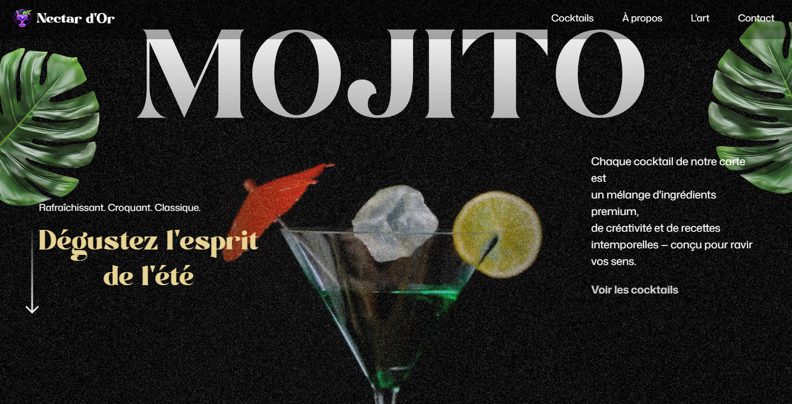

<div align="center">
  
  
  <h1>🍹 Nectar - Votre Bar à Cocktails d'Exception</h1>
  
  [](https://opensource.org/licenses/MIT)
  [](https://reactjs.org/)
  [](https://vitejs.dev/)
  [](https://tailwindcss.com/)
  [](https://greensock.com/gsap/)
  [](https://gsap.com/resources/React/)
  [](https://www.npmjs.com/package/react-responsive)
  [](https://ffmpeg.org/)

_Découvrez l'art du cocktail dans une expérience en ligne immersive_
_Une sélection exclusive de boissons raffinées, préparées avec passion et créativité_

</div>

## 🌟 Présentation de Nectar

Nectar est un site web moderne et élégant pour un bar à cocktails haut de gamme. Ce projet met en valeur l'art de la mixologie à travers une expérience utilisateur fluide et des animations élégantes.

## ✨ Fonctionnalités

### 🎯 Navigation et Structure

- **Barre de navigation** : Animée au défilement avec des liens dynamiques
- **Structure modulaire** : Données centralisées pour une gestion simplifiée (cocktails, mocktails, profils, fonctionnalités, etc.)
- **Navigation fluide** : Accès rapide aux différentes sections du site

### 🎥 Expérience Immersive

- **Section Héros** : Présentation visuelle avec vidéo synchronisée au défilement
- **Adaptabilité** : Comportement réactif optimisé pour mobile et desktop
- **Animations** : Transitions fluides et effets de parallaxe
- **Chargement intelligent** : Initialisation des médias uniquement lorsqu'ils sont visibles

### 🍸 Découverte des Cocktails

- **Sélection organisée** : Cocktails populaires et mocktails soigneusement classés
- **Fiches détaillées** : Informations complètes (nom, origine, détails, prix)
- **Design épuré** : Présentation claire et facile à parcourir
- **Effets visuels** : Animations de feuilles en parallaxe lors du défilement

### 🎨 Section Artistique

- **Animations élégantes** : Fondus échelonnés et effets de révélation fluides
- **Design réactif** : Adapté à tous les écrans (mobile, tablette, desktop)
- **Narration visuelle** : Combinaison harmonieuse de textes descriptifs et d'éléments visuels
- **Intégration fluide** : S'intègre naturellement dans le flux de la page
- **Expérience immersive** : Transitions douces déclenchées au défilement

### 🍹 Menu Interactif

- **Navigation intuitive** : Parcours fluide entre les différents cocktails avec des animations GSAP
- **Galerie dynamique** : Affichage en temps réel des détails du cocktail sélectionné
- **Contrôles tactiles** : Navigation avant/arrière avec boutons dédiés
- **Indicateur visuel** : Mise en évidence du cocktail actif dans la barre de navigation
- **Animations fluides** : Transitions élégantes entre les cocktails
- **Design accessible** : Navigation clavier et lecteurs d'écran pris en charge
- **Interface réactive** : Adaptée à tous les appareils

### 📖 À Propos

- **Narration visuelle** : Mise en page en quinconce avec animations au défilement
- **Histoire de la marque** : Contenu riche mettant en valeur l'identité du bar
- **Preuves sociales** : Indicateurs d'engagement (12 000+ clients, évaluations)
- **Galerie intégrée** : Grille d'images avec superpositions décoratives

### 📞 Contact et Informations

- **Coordonnées complètes** : Adresse, téléphone et email facilement accessibles
- **Horaires d'ouverture** : Mise à jour dynamique des horaires d'ouverture
- **Réseaux sociaux** : Liens vers les plateformes de médias sociaux
- **Formulaire de contact** : Pour les réservations et demandes spéciales

## 🚀 Technologies utilisées

### Frontend

- **Framework** : [React 19.1.1](https://react.dev/) avec [Vite 7.1.7](https://vitejs.dev/)
- **Styling** : [Tailwind CSS 4.1.14](https://tailwindcss.com/) avec configuration personnalisée
- **Animations** : [GSAP 3.13.0](https://greensock.com/gsap/) avec [@gsap/react 2.1.2](https://gsap.com/resources/React/)
- **Responsive** : [React Responsive 10.0.1](https://www.npmjs.com/package/react-responsive)
- **Traitement multimédia** : [FFmpeg 6.1](https://ffmpeg.org/) pour la manipulation avancée des médias
- **Optimisation** : Chargement paresseux, code splitting et compression des assets
- **Accessibilité** : Support ARIA et navigation au clavier complète

## ⚙️ Configuration & Installation

### Prérequis
- Node.js 16+ (recommandé : LTS)
- npm ou yarn
- FFmpeg (pour le traitement des médias)

### Installation des dépendances
```bash
# Créer un nouveau projet Vite avec React
npm create vite@latest ./

# Installer les dépendances principales
npm install gsap @gsap/react react-responsive

# Installer Tailwind CSS
npm install -D tailwindcss @tailwindcss/vite
```

### Configuration FFmpeg
Téléchargez FFmpeg pour Windows :  
[📥 Télécharger FFmpeg (Windows 64-bit)](https://github.com/BtbN/FFmpeg-Builds/releases/latest/download/ffmpeg-master-latest-win64-gpl-shared.zip)

Commande pour optimiser les vidéos :
```bash
ffmpeg -i input.mp4 -vf scale=960:-1 -movflags faststart -vcodec libx264 -crf 20 -g 1 -pix_fmt yuv420p output.mp4
```

### Instructions d'installation
1. **Cloner le dépôt**
   ```bash
   git clone https://github.com/KemogneAlex/nectar.git
   cd nectar
   ```

2. **Installer les dépendances**
   ```bash
   npm install
   # ou
   yarn install
   ```

3. **Lancer l'environnement de développement**
   ```bash
   npm run dev
   # ou
   yarn dev
   ```

4. **Ouvrir dans le navigateur**
   L'application sera disponible à l'adresse : [http://localhost:5173](http://localhost:5173)

### Liens Utiles
- 📚 [Documentation GSAP](https://gsap.com/docs/v3/)
- 🎨 [Guide Tailwind CSS avec Vite](https://tailwindcss.com/docs/installation/using-vite)
- 🛠️ [Télécharger FFmpeg](https://github.com/BtbN/FFmpeg-Builds/releases/latest)

[](https://github.com/KemogneAlex/nectar/stargazers)
[](https://github.com/KemogneAlex/nectar/network/members)
[](https://github.com/KemogneAlex/nectar/issues)
[](https://github.com/KemogneAlex/nectar/blob/main/LICENSE)

1. **Cloner le dépôt**

   ```bash
   git clone https://github.com/KemogneAlex/nectar.git
   cd nectar
   ```

2. **Installer les dépendances**

   ```bash
   npm install
   # ou
   yarn install
   ```

3. **Lancer l'environnement de développement**

   ```bash
   npm run dev
   # ou
   yarn dev
   ```

4. **Ouvrir dans le navigateur**
   L'application sera disponible à l'adresse : [http://localhost:5173](http://localhost:5173)

## 🏗️ Structure du projet

```
nectar/
├── public/             # Fichiers statiques (images, polices, etc.)
├── src/
│   ├── assets/         # Ressources statiques (images, icônes)
│   ├── components/     # Composants React réutilisables
│   │   ├── About.jsx   # Section À propos
│   │   ├── Art.jsx     # Section artistique
│   │   ├── Contact.jsx # Formulaire de contact
│   │   ├── Hero.jsx    # Bannière principale
│   │   ├── Menu.jsx    # Carte des cocktails
│   │   └── Navbar.jsx  # Barre de navigation
│   ├── App.jsx         # Composant racine
│   └── main.jsx        # Point d'entrée de l'application
├── .gitignore
├── index.html
├── package.json
├── README.md
└── vite.config.js
```

## 📱 Compatibilité

- Navigateurs modernes (Chrome, Firefox, Safari, Edge)
- Mobile-first design
- Compatible avec les dernières versions des navigateurs mobiles

## 📄 Licence

Ce projet est sous licence MIT.

## ✉️ Contact

Pour toute question ou suggestion, n'hésitez pas à me contacter à [kemognemalone@gmail.com](mailto:kemognemalone@gmail.com).

---

<div align="center">
  <p>Développé avec ❤️ par Kemogne Alex</p>
  <p>© 2025 Nectar - Tous droits réservés</p>
</div>
